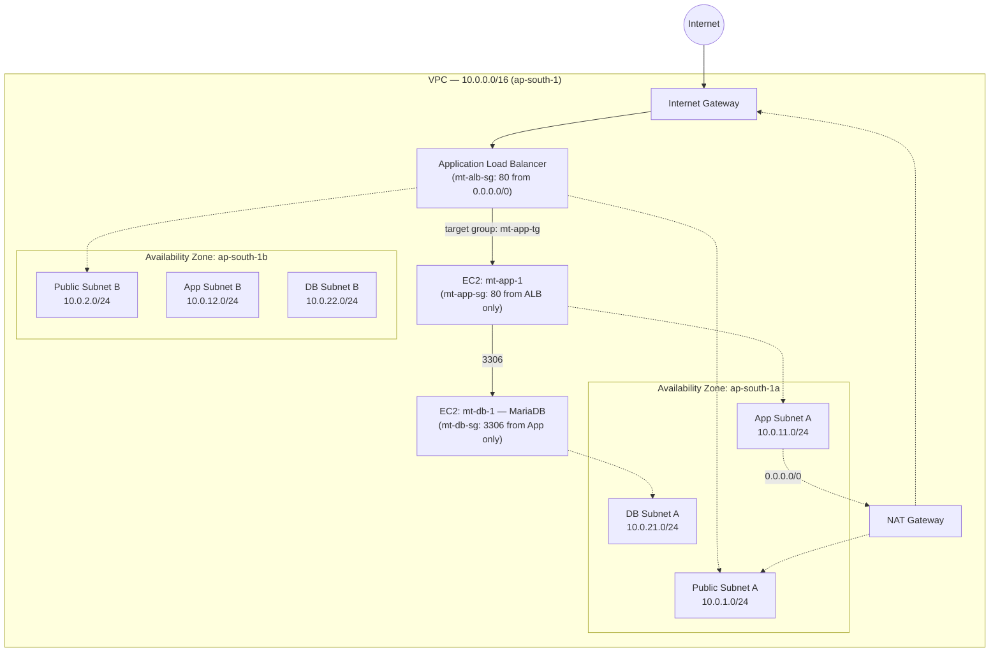

# Multi-Tier VPC Architecture on AWS

A production-style 3-tier network built manually on AWS to demonstrate secure,
highly-available infrastructure design — the same pattern used behind most
enterprise web applications.

**Internet → Load Balancer → Application Tier → Database Tier**, each tier
isolated from the ones it doesn't need to talk to, with all administrative
access via SSM (no SSH, no open management ports, no key pairs to leak).

---

## Architecture



**Design rule:** every tier can only be reached by the tier directly in front
of it. The database has no route to the internet at all — not even for
outbound traffic — by design, not by accident.

---

## Components

| Layer | Resource | Purpose |
|---|---|---|
| Network | VPC `10.0.0.0/16` | Isolated network, spans 2 AZs for HA |
| Network | 6 subnets (2 public / 2 app / 2 DB) | One per tier per AZ |
| Network | Internet Gateway | Single, VPC-wide, AWS-managed HA — attaches to the whole VPC, not a subnet |
| Network | NAT Gateway (1, in `mt-public-a`) | Outbound-only internet for the app tier. Production would run one per AZ |
| Compute | ALB (`mt-alb`) | Public entry point, spans both public subnets |
| Compute | EC2 `mt-app-1` | Application tier, private subnet, no public IP |
| Compute | EC2 `mt-db-1` (MariaDB) | Database tier, private subnet, no internet route at all |
| Access | IAM role `mt-ec2-ssm-role` + SSM Session Manager | All administrative access — zero SSH ports open, no key pairs |

## Security Group Chain

Each security group references the *previous* group by ID, not by IP range —
so the rule stays correct even if instances are replaced:

```
Internet (0.0.0.0/0)
      │  HTTP:80
      ▼
  mt-alb-sg
      │  HTTP:80, source = mt-alb-sg
      ▼
  mt-app-sg
      │  MySQL:3306, source = mt-app-sg
      ▼
  mt-db-sg
```

Outbound on every group is left open (`0.0.0.0/0`, all traffic) — the real
security boundary in this design is **inbound rules + route tables**, not
outbound restriction. Restricting outbound to a specific SG would have (and
did, during testing) blocked legitimate management traffic like SSM's HTTPS
calls without adding real security, since the route tables already prevent
the DB tier from reaching the internet in the first place.

## Route Tables

| Route Table | Associated Subnets | Routes |
|---|---|---|
| `mt-public-rt` | public-a, public-b | `10.0.0.0/16 → local`, `0.0.0.0/0 → IGW` |
| `mt-app-rt` | app-a, app-b | `10.0.0.0/16 → local`, `0.0.0.0/0 → NAT` |
| `mt-db-rt` | db-a, db-b | `10.0.0.0/16 → local` **only — no internet route** |

---

## Verification / Proof of Architecture

Screenshots for every item below are in [`/screenshots`](./screenshots).

| # | Test | Result | Evidence |
|---|---|---|---|
| 1 | VPC, subnets, route tables provisioned correctly | ✅ | `01-vpc-network-setup/` |
| 2 | Security group chain configured (SG-to-SG, not IP-based) | ✅ | `02-security-groups/` |
| 3 | SSM access to app tier, zero SSH ports open | ✅ | `03-ssm-access/` |
| 4 | **App tier → DB tier reachable on 3306** (proves the SG chain works) | ✅ CONNECTED | `07-isolation-proof/01-app-to-db-connected-port3306.png` |
| 5 | **DB tier has zero internet access** once the NAT test-route is removed (proves real isolation, not just an SG rule on paper) | ✅ Confirmed via SSM agent's own timeout error | `07-isolation-proof/02-db-isolated-after-route-removed.png` |
| 6 | ALB → target group → app tier, tested from the public internet | ✅ `Hello from mt-app-1` | `05-alb-testing/` |
| 7 | Both EC2 instances running with no public IP | ✅ | `06-instances/` |

**How test #4/#5 were done:** the DB tier is permanently cut off from the
internet by its route table. To prove the app→DB path specifically (rather
than just trusting the config), a temporary `0.0.0.0/0 → NAT` route was
added to `mt-db-rt` for testing only, then removed immediately after. This
is documented explicitly rather than left silent, since leaving that route
in place would defeat the entire point of the DB tier's isolation.

---

## Troubleshooting Log

Real issues hit and resolved during the build — kept here because working
through them is the actual skill, not just the final diagram.

### 1. SSM wouldn't connect — DNS hostnames disabled
**Symptom:** `dial tcp ...:443: i/o timeout` when trying to reach the SSM
endpoint, despite a correctly attached IAM role.
**Cause:** the VPC's **"Enable DNS hostnames"** setting was off (the
"VPC only" creation wizard doesn't turn this on by default), so the
instance couldn't resolve `ssm.ap-south-1.amazonaws.com`.
**Fix:** VPC → Edit VPC settings → enable DNS hostnames.

### 2. SSM still blocked after fixing DNS — security group outbound too narrow
**Symptom:** Same timeout, after DNS was fixed.
**Cause:** `mt-app-sg`'s outbound rule only allowed port 80 (HTTP). SSM
needs outbound **443** (HTTPS), which was blocked.
**Fix:** changed outbound to All traffic, `0.0.0.0/0` — outbound is
generally left open; inbound is the real boundary.

### 3. Same outbound issue on the DB tier
**Cause:** `mt-db-sg`'s outbound was scoped to MySQL/3306 only, which
also blocked SSM's 443 traffic to the DB instance.
**Fix:** same as above — All traffic outbound. Real isolation for the DB
tier comes from its **route table having no path to the internet at all**,
not from restricting the security group's outbound rule.

### 4. DB → App inbound rule silently didn't save
**Symptom:** app→DB connectivity test failed with "connection refused."
**Cause:** an earlier attempt to add the MySQL/3306 inbound rule (source
`mt-app-sg`) wasn't saved correctly.
**Fix:** re-added the rule and confirmed **Inbound rules (1)** actually
showed the new rule with source `sg-xxxx (mt-app-sg)`.

### 5. SSM Ping status stuck "Online" long after access was actually cut
**Symptom:** after deleting the DB tier's temporary NAT route, the console
still showed `Ping status: Online` for 10+ minutes.
**Lesson:** the console's Ping status is a cached heartbeat, not a live
check — it lags real network state by several minutes. The reliable test
is a **live command inside an active session** (`curl ifconfig.me`) or a
**brand-new** connection attempt, not the status indicator.

### 6. Stale SSM agent registration after a long-idle instance
**Symptom:** `Session Manager connection status: Not connected` even
though `Ping status: Online` and the IAM role was correctly attached.
**Fix:** rebooting the instance forced the SSM agent to fully
re-register, which resolved it immediately.

---

## Cost Notes

| Resource | Cost while running | Notes |
|---|---|---|
| VPC, subnets, route tables, SGs, IGW | Free | Always free |
| EC2 (`t3.micro` × 2) | Free tier (750 hrs/month) | |
| **NAT Gateway** | ~$0.045/hr + data | **Only paid resource** — deleted after each session |
| **ALB** | ~$0.0225/hr + LCU | **Deleted after each testing session** |
| Elastic IP | Free while attached | Bills if left unattached — released after every NAT deletion |

Both the NAT Gateway and ALB were deliberately torn down between working
sessions to avoid unnecessary cost, and rebuilt in ~5 minutes each time
they were needed again.

## What Production Would Add

- One NAT Gateway **per AZ** (this build uses one, as a documented,
  intentional cost trade-off for a personal project)
- RDS Multi-AZ instead of a bare EC2 instance for the database tier
- VPC Interface Endpoints for SSM, so private instances never need NAT
  at all for management traffic
- Auto Scaling Group for the app tier, registered into the same target
  group
- HTTPS listener on the ALB with an ACM certificate

## Repository Structure

```
.
├── README.md
├── screenshots/
│   ├── 01-vpc-network-setup/
│   ├── 02-security-groups/
│   ├── 03-ssm-access/
│   ├── 04-troubleshooting/
│   ├── 05-alb-testing/
│   ├── 06-instances/
│   └── 07-isolation-proof/
└── terraform/            # this same architecture as Infrastructure-as-Code (next project)
```

---

*Built manually first — every resource created by hand, one at a time —
before automating it in Terraform, so every decision above could be
explained rather than just deployed.*
